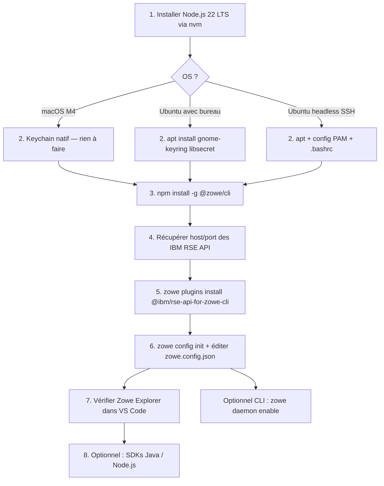

# Prérequis — Zowe CLI, Zowe Explorer & SDKs

Ce guide couvre les deux architectures clientes supportées :

| Poste | OS | Architecture |
|---|---|---|
| MacBook (puce Apple) | macOS (dernière version) | **ARM64 (M4)** |
| Workstation / VM | Ubuntu 24.04 LTS ou 26.04 LTS | **x86-64** |

Il part du principe que vous disposez déjà de :

| Composant | Statut | Remarque |
|---|---|---|
| Java JDK 21 | ✅ Conforme | Minimum requis : JRE 17. JDK 21 est pleinement supporté. |
| VS Code (dernière version) | ✅ Conforme | Minimum requis : VS Code 1.90.0+ |
| IBM ADFZ / Z Open Editor / Z Open Debug | ✅ Installés | Ces extensions utilisent les IBM RSE API nativement. |
| Node.js 22 LTS | ✅ Cible | Voir section 1 pour l'installation. |

!!! info "Connectivité Mainframe — IBM RSE API"
    La communication avec le mainframe s'effectue via les **IBM RSE API** (Remote System Explorer API), et non via z/OSMF.  
    z/OSMF est réservé à la pile TCP/IP d'administration (équipes ingénieurs système CA-GIP).  
    Les RSE API exposent les mêmes services (datasets, USS, jobs) sur la pile TCP/IP utilisateur.

---

## 1. Node.js 22 LTS

`nvm` (Node Version Manager) est la méthode recommandée — elle permet de gérer plusieurs versions Node.js sur le même poste sans droits administrateur.

=== "macOS M4"

    macOS utilise **zsh** par défaut depuis Catalina.

    ```bash
    # Installer nvm
    curl -o- https://raw.githubusercontent.com/nvm-sh/nvm/v0.39.7/install.sh | bash
    source ~/.zshrc

    # Installer Node.js 22 LTS
    nvm install 22
    nvm use 22
    nvm alias default 22
    ```

    !!! tip "Rosetta 2 non nécessaire"
        Node.js 22 LTS fournit des binaires natifs ARM64. Aucune couche de compatibilité Rosetta 2 n'est requise.

=== "Ubuntu 24.04 / 26.04"

    Ubuntu utilise **bash** par défaut.

    ```bash
    # Installer nvm
    curl -o- https://raw.githubusercontent.com/nvm-sh/nvm/v0.39.7/install.sh | bash
    source ~/.bashrc

    # Installer Node.js 22 LTS
    nvm install 22
    nvm use 22
    nvm alias default 22
    ```

### Vérifier

```bash
node --version   # v22.x.x
npm --version
```

!!! note "Pourquoi Node.js 22 LTS ?"
    Zowe v3.4 supporte Node.js 20 à 24. La version 22 est l'**Active LTS** jusqu'en avril 2027 — c'est le choix le plus stable et le mieux testé, disponible en natif sur ARM64 et x86-64.

---

## 2. Stockage sécurisé des identifiants

Zowe CLI et Zowe Explorer stockent les credentials dans le coffre-fort natif du système d'exploitation. La configuration varie selon la plateforme.

=== "macOS M4"

    !!! success "Aucune installation requise"
        macOS utilise le **Trousseau d'accès** (Keychain) nativement. Zowe CLI le détecte et l'utilise automatiquement.  
        Aucun paquet supplémentaire n'est à installer.

=== "Ubuntu 24.04 / 26.04 — Poste avec interface graphique"

    Sur un poste Ubuntu avec session GNOME, le keyring est déverrouillé automatiquement à la connexion. Il faut simplement vérifier que les paquets sont présents :

    ```bash
    sudo apt update
    sudo apt install -y gnome-keyring libsecret-1-0 libsecret-1-dev
    ```

    Le keyring sera disponible dès la prochaine connexion à la session graphique.

=== "Ubuntu 24.04 / 26.04 — Headless / SSH"

    !!! danger "Prérequis obligatoire"
        Sans interface graphique, le keyring Gnome n'est pas déverrouillé automatiquement.  
        Sans cette configuration, chaque commande Zowe échouera avec une erreur de credential store.

    **Étape 1 — Installer les paquets**

    ```bash
    sudo apt update
    sudo apt install -y gnome-keyring libsecret-1-0 libsecret-1-dev libpam-gnome-keyring
    ```

    **Étape 2 — Configurer le déverrouillage automatique via PAM**

    Éditez `/etc/pam.d/login` (TTY) **et** `/etc/pam.d/sshd` (SSH).  
    Ajoutez ces deux lignes à la fin de chaque fichier :

    ```
    auth     optional  pam_gnome_keyring.so
    session  optional  pam_gnome_keyring.so auto_start
    ```

    **Étape 3 — Initialiser le daemon DBus au login**

    Ajoutez dans `~/.bashrc` :

    ```bash
    export $(dbus-launch)
    eval $(gnome-keyring-daemon --start --components=secrets)
    ```

    **Étape 4 — Redémarrer la session**

    Déconnectez-vous puis reconnectez-vous en SSH. Le keyring est maintenant déverrouillé automatiquement.

    **Déverrouillage manuel (session courante uniquement)**

    Si vous avez besoin d'un déverrouillage immédiat sans redémarrer la session :

    ```bash
    gnome-keyring-daemon -r --unlock --components=secrets
    # → Tapez votre mot de passe Linux, puis Ctrl+D
    ```

---

## 3. Installer Zowe CLI

La commande est identique sur les deux plateformes :

```bash
npm install -g @zowe/cli@zowe-v3-lts
```

### Vérifier

```bash
zowe --version
```

!!! note "Avertissements `cpu-features` ou `ssh` à l'installation"
    Ces messages apparaissent lors de la compilation de modules natifs — ils sont bénignes et n'affectent pas le fonctionnement de Zowe CLI. Sur macOS M4, des avertissements ARM64 peuvent également apparaître pour la même raison.

!!! note "Ubuntu : permission refusée (EACCES)"
    Si vous obtenez une erreur `EACCES` lors de l'installation globale, configurez npm pour ne pas nécessiter sudo :
    ```bash
    mkdir -p ~/.npm-global
    npm config set prefix ~/.npm-global
    echo 'export PATH="$HOME/.npm-global/bin:$PATH"' >> ~/.bashrc
    source ~/.bashrc
    ```
    Relancez ensuite `npm install -g @zowe/cli@zowe-v3-lts`.

---

## 4. Prérequis côté Mainframe — IBM RSE API

Les IBM RSE API (Remote System Explorer API) sont le point d'entrée côté mainframe pour les développeurs.  
Elles sont distinctes de z/OSMF et utilisent la pile TCP/IP utilisateur, accessible depuis les postes macOS et Ubuntu.

### 4.1 Ce qui doit être actif sur le mainframe

| Composant | Rôle | Configuré par |
|---|---|---|
| **IBM RSE API daemon** | Serveur REST exposant datasets, USS, jobs | Administrateur systèmes |
| **Autorisation SAF utilisateur** | Accès aux ressources z/OS | Administrateur sécurité |

!!! note "Pas de z/OSMF requis pour les développeurs"
    z/OSMF est configuré sur la LPAR mais réservé à la pile TCP/IP d'administration (CA-GIP).  
    Les RSE API sont accessibles sur la pile TCP/IP utilisateur depuis macOS et Ubuntu.

### 4.2 Environnements disponibles

| Environnement | Hostname | Port | Protocole |
|---|---|---|---|
| **Bac à sable** | `sysb.prodinfo.fr.cly` | `6800` | HTTPS |
| **Dev / Prod** | `dev.prodfindo.fr.cly` | `6800` | HTTPS |

---

## 5. Initialiser la Team Configuration (V3) avec les RSE API

Zowe V3 utilise `~/.zowe/zowe.config.json` pour gérer les profils de connexion.  
Avec les IBM RSE API, le type de profil est **`rse`**.

### 5.1 Installer le plug-in IBM RSE API

```bash
zowe plugins install @ibm/rse-api-for-zowe-cli
zowe plugins list   # vérification
```

### 5.2 Initialiser la configuration globale

```bash
zowe config init --global-config
```

Répondez aux prompts. Zowe détecte les plug-ins installés et génère les sections correspondantes dans `zowe.config.json`.

### 5.3 Éditer `~/.zowe/zowe.config.json`

Deux profils sont configurés : un par environnement.

```json
{
  "$schema": "./zowe.schema.json",
  "profiles": {
    "rse_sandbox": {
      "type": "rse",
      "properties": {
        "host": "sysb.prodinfo.fr.cly",
        "port": 6800,
        "rejectUnauthorized": false
      },
      "secure": ["user", "password"]
    },
    "rse_dev": {
      "type": "rse",
      "properties": {
        "host": "dev.prodfindo.fr.cly",
        "port": 6800,
        "rejectUnauthorized": false
      },
      "secure": ["user", "password"]
    },
    "global_base": {
      "type": "base",
      "properties": {
        "rejectUnauthorized": false
      },
      "secure": ["user", "password"]
    }
  },
  "defaults": {
    "rse": "rse_sandbox",
    "base": "global_base"
  },
  "autoStore": true
}
```

Le profil `rse_sandbox` est défini par défaut. Pour basculer sur `rse_dev` :

```bash
zowe config set defaults.rse rse_dev
```

Pour revenir sur le bac à sable :

```bash
zowe config set defaults.rse rse_sandbox
```

!!! warning "`rejectUnauthorized: false`"
    À utiliser uniquement si le serveur RSE API expose un certificat auto-signé. Avec un certificat signé par une CA reconnue, passez à `true`.

### 5.4 Premier accès — saisie des credentials

```bash
# Sur le bac à sable (défaut)
zowe rse list ds "MONUSER.*"

# Sur dev/prod (profil explicite)
zowe rse list ds "MONUSER.*" --profile rse_dev

# → Prompt : username / password au premier appel
# → Stockés dans le Trousseau macOS ou le keyring Gnome (Ubuntu)
```

---

## 6. Mode Daemon (Zowe CLI uniquement — optionnel)

!!! info "Ne concerne pas Zowe Explorer ni les extensions VS Code"
    Le daemon accélère uniquement **`zowe` en ligne de commande**.  
    Zowe Explorer, Z Open Editor et Z Open Debug tournent dans le processus VS Code — le daemon ne les affecte pas.

=== "macOS M4"

    ```bash
    zowe daemon enable
    ```

    Ajoutez `.zowe/bin` à votre PATH dans `~/.zshrc` :

    ```bash
    echo 'export PATH="$HOME/.zowe/bin:$PATH"' >> ~/.zshrc
    source ~/.zshrc
    ```

=== "Ubuntu 24.04 / 26.04"

    ```bash
    zowe daemon enable
    ```

    Ajoutez `.zowe/bin` à votre PATH dans `~/.bashrc` :

    ```bash
    echo 'export PATH="$HOME/.zowe/bin:$PATH"' >> ~/.bashrc
    source ~/.bashrc
    ```

### Redémarrer / Désactiver

```bash
zowe daemon restart   # après mise à jour ou changement de config
zowe daemon disable   # pour désactiver
```

---

## 7. Zowe Explorer pour VS Code

### Prérequis

| Prérequis | macOS M4 | Ubuntu 24.04 / 26.04 |
|---|---|---|
| VS Code | 1.90.0+ ✅ | 1.90.0+ ✅ |
| Architecture VS Code | ARM64 natif | x86-64 |

!!! warning "VS Code sur macOS M4 — choisir la bonne version"
    Téléchargez impérativement la version **Apple Silicon** de VS Code (`.dmg` Apple Silicon), et non la version Universal ou Intel. La version Intel fonctionnerait via Rosetta 2 mais les extensions natives (comme certains composants Zowe) seraient moins performantes.

### Installation

1. Ouvrez VS Code
2. Extensions (++ctrl+shift+x++)
3. Recherchez `Zowe Explorer`
4. **Install** → Redémarrez VS Code

!!! note "Déjà présent via IBM ADFZ ?"
    IBM ADFZ embarque Zowe Explorer. Vérifiez dans **Extensions → Installed** avant de réinstaller.

### Connexion via RSE API

Zowe Explorer lit automatiquement `~/.zowe/zowe.config.json` configuré à l'étape 5.  
Le profil `rse_lpar1` apparaît dans les vues **Data Sets**, **USS** et **Jobs**.

!!! tip "IBM Z Open Editor et Zowe Explorer coexistent"
    Z Open Editor utilise les RSE API de façon indépendante — les deux extensions fonctionnent en parallèle sans conflit.

---

## 8. SDKs Zowe

Tous les SDKs fonctionnent nativement sur macOS ARM64 et Ubuntu x86-64.

L'ordre d'usage privilégié dans ce projet est le suivant :

| Priorité | SDK | Prérequis | Installation |
|---|---|---|---|
| 1 — Privilégié | **Python SDK** | Python 3.6+ | `pip install <package>` |
| 2 | **Node.js SDK** | Node.js 22 LTS ✅ | `npm install <package>` |
| 3 | **Java SDK** | JRE 17+ ✅ (JDK 21 conforme) | Maven / Gradle |

### Python SDK

```bash
pip install zos-files-for-zowe-sdk
```

### Node.js SDK

```bash
npm install @zowe/zos-files-for-zowe-sdk
```

### Java SDK (Maven)

```xml
<dependency>
  <groupId>org.zowe.client.java.sdk</groupId>
  <artifactId>zos-files-for-zowe-sdk</artifactId>
  <version>LATEST</version>
</dependency>
```

---

## Récapitulatif — Ordre d'installation recommandé


