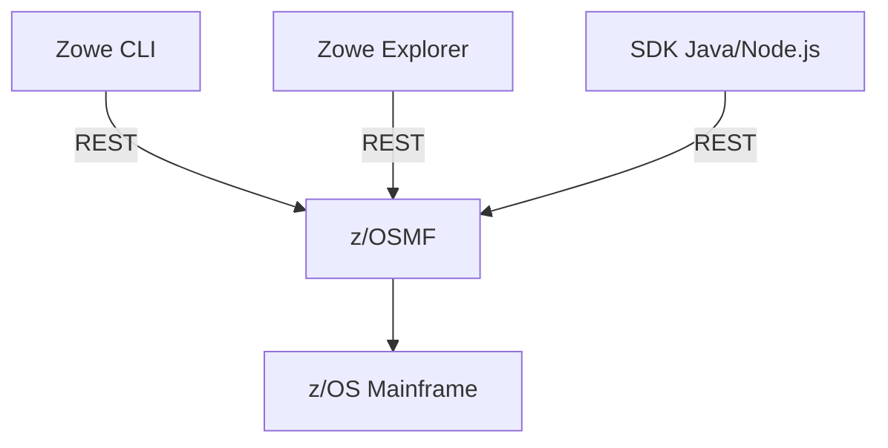

# Documentation Zowe

Bienvenue dans la documentation technique Zowe — centrée sur l'usage **client** :
Zowe CLI, Zowe Explorer pour VS Code et les SDKs Zowe.

## Par où commencer ?

- [Prérequis](getting-started/prerequisites.md) — ce qu'il faut installer et configurer avant toute chose

## Exemple Mermaid

